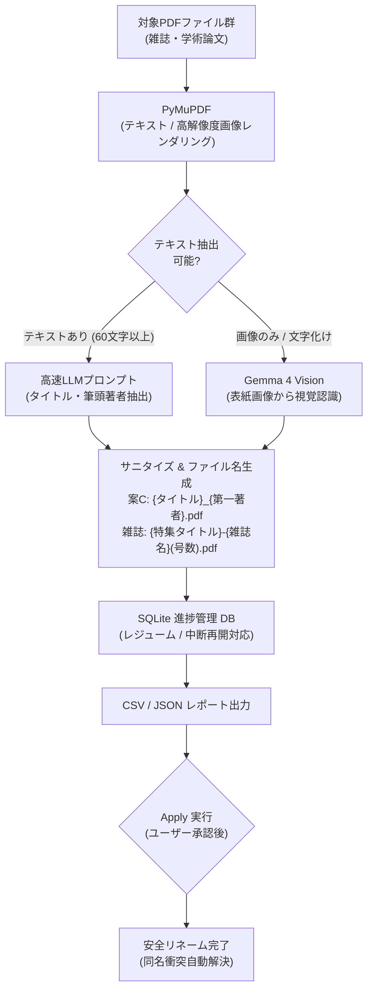

# Local LLM PDF Renamer 📚⚡

> **ローカルGPU（Gemma 4 Vision）を活用した大量PDF（雑誌・学術論文）の自動タイトル認識・安全リネームシステム**  
> AIエージェント（OpenClaw等）の「ハルシネーション・スタック問題」を克服し、完全自律・切断耐性を持つバックグラウンドバッチ処理を実現。

[](https://opensource.org/licenses/MIT)
[](https://www.python.org/downloads/)
[](https://ollama.ai)

---

## 🌟 主な特徴

1. **Vision（画像認識）× テキストのハイブリッド解析**
   * テキスト埋め込みPDFは先頭ページテキストから超高速抽出（約1〜2秒）。
   * スキャン画像PDFや文字化けPDFは、自動で **Gemma 4 Vision** にフォールバックして表紙画像から直接タイトル・著者・雑誌名を高精度読み取り。
2. **完全自律・切断耐性（systemd-run --user）**
   * ターミナル切断やPCスリープ・復帰時も停止しない完全バックグラウンドサービス化。
3. **3段階の安全運用アーキテクチャ**
   * **Phase 1 (Dry-run):** 実際のファイル変更は行わず、全件の解析結果を SQLite DB および CSV レポートに出力。
   * **Phase 2 (Apply):** CSV確認後、同名重複（`_1`, `_2`）を自動回避しながらワンクリックで一括リネーム。
   * **Phase 3 (Rollback):** 万が一元に戻したい場合も、一発で元のファイル名へ完全復元可能。
4. **AIエージェント運用の知見を凝縮**
   * OpenClawなどの自律AIエージェントが「作業したふりをして口約束だけで停止する（ハルシネーション）」現象を防止するプロンプト設計と設計パターンを同梱。

---

## 🏗️ システムアーキテクチャ



---

## 📁 フォルダ構成とスクリプト一覧

```
local-llm-pdf-renamer/
├── scripts/
│   ├── rename_magazines.py       # 雑誌PDF用（表紙探索・特集タイトル抽出）
│   ├── rename_papers.py          # 論文PDF用（タイトル_第一著者抽出）
│   ├── run_batch.sh              # 雑誌用 systemd バックグラウンド起動ラッパー
│   ├── run_papers_batch.sh       # 論文用 systemd バックグラウンド起動ラッパー
│   ├── status_batch.sh           # 雑誌用 リアルタイム進捗確認スクリプト
│   └── status_papers_batch.sh    # 論文用 リアルタイム進捗確認スクリプト
├── docs/
│   └── index.html                # GitHub Pages用公開サイト
├── .gitignore
├── LICENSE
└── README.md
```

---

## 🚀 使い方

### 1. 必要環境の準備
* Python 3.10+
* [Ollama](https://ollama.ai) が稼働していること
  ```bash
  ollama pull gemma4:latest
  ```
* 依存Pythonパッケージのインストール:
  ```bash
  pip install pymupdf requests
  ```

---

### 2. 論文PDFのリネーム（案C: `{タイトル}_{第一著者}.pdf`）

#### ① 解析の実行（Dry-run: 変更は加えずCSVに出力）
```bash
./scripts/run_papers_batch.sh --dry-run
```

#### ② 進捗の確認
```bash
./scripts/status_papers_batch.sh
```
またはリアルタイムログの閲覧:
```bash
journalctl --user -u paper-rename -f
```

#### ③ レポートの確認とリネーム適用（Apply）
生成された `data/paper_rename_report.csv` を確認し、問題がなければ一括適用:
```bash
python3 scripts/rename_papers.py --apply
```

#### ④ 万が一元に戻したい場合（Rollback）
```bash
python3 scripts/rename_papers.py --rollback
```

---

### 3. 雑誌PDFのリネーム（`{特集タイトル}-{雑誌名}(号数).pdf`）

```bash
# 1. バックグラウンド解析起動
./scripts/run_batch.sh --dry-run

# 2. 進捗確認
./scripts/status_batch.sh

# 3. リネーム適用
python3 scripts/rename_magazines.py --apply

# 4. ロールバック
python3 scripts/rename_magazines.py --rollback
```

---

## 📊 実際のリネーム実績（実測値）

| 分類 | 対象数 | 成功件数 | 元ファイル名の例 | リネーム後のファイル名 |
| :--- | :--- | :--- | :--- | :--- |
| **雑誌PDF** | 357件 | **353件** | `Document_20251009_0008.pdf` | **`最新知識から めまい症例を診る！-JOHNS(2021年1月号 Vol. 37 No. 1).pdf`** |
| | | | `Document_20251009_0007.pdf` | **`耳鼻咽喉科の 問診のポイント 一どこまで診断に近づけるかー-ENTONI(2020年4月 No.244).pdf`** |
| | | | `Document_20251009_0006.pdf` | **`広島会報(平成26年7月号, 第86号).pdf`** |
| **論文PDF** | 498件 | **490件+** | `download (25).pdf` | **`B スポット再発見_角 卓郎.pdf`** |
| | | | `download (26).pdf` | **`喉頭炎に対するネブライザー治療_鈴木.pdf`** |
| | | | `download (28).pdf` | **`急性錐体尖炎から細菌性髄膜炎をきたした成人例_関根.pdf`** |
| | | | `新規ドキュメント8.pdf` | **`Multimodal Outcomes of Early Open Extended Midline..._Agata M Plonczak.pdf`** |
| | | | `17_91.pdf` (文字化け) | **`House dust as an indoor environmental contaminant_池田四郎.pdf`** |

---

## 💡 AIエージェント（OpenClaw等）を確実に動かすプロンプト

AIエージェントにチャットで大量処理を依頼すると、「口約束で作業完了と嘘をつく（ハルシネーション）」現象が起こりやすくなります。以下のテンプレートを使用することで確実に自律実行させることができます。

```markdown
【指示】
以下のフォルダにあるPDFを整理・リネームしてください。
対象フォルダ: /パス/to/フォルダ

【厳守ルール】
1. チャットの会話だけで進捗を報告しないでください。必ず bash ツールを使って実際にコードを作成・実行してください。
2. 処理数が多いので、チャットの返答で処理するのではなく、Pythonスクリプトを作成して systemd-run または nohup でバックグラウンド実行してください。
3. いきなりファイルを書き換えず、まずは Dry-run（解析のみ行い、変更前後の対応表を CSV に出力）で実行してください。
4. 処理が途中で止まっても再開できるよう、SQLite や JSON で1ファイルごとに進捗を保存（レジューム対応）してください。
5. 処理を開始したら、現在の進捗（件数と内訳）を確認できる status 用のシェルスクリプトを作成し、その実行コマンドを私に教えてください。
```

---

## 📜 ライセンス

[MIT License](LICENSE) © 2026 rhinoxy
